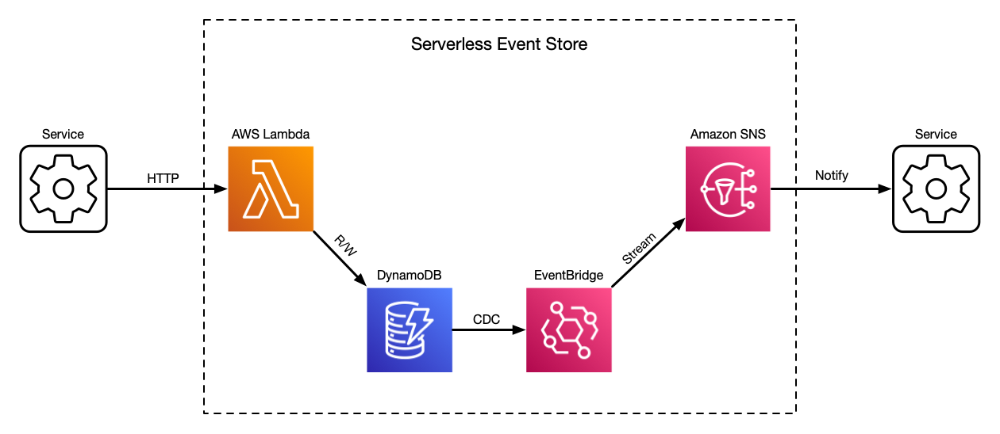

# serverless-event-store - Go + AWS for Event Sourcing

## Feedback

I am happy to help you put this Event Store to use.

Please let me know for which company, product and use case it was helpful.

See you at [LinkedIn](https://www.linkedin.com/in/iliatolliu/)

## Technologies

* Go language
* AWS Lambda to run
* AWS DynamoDB to store data
* AWS SNS to notify about updates
* AWS CloudWatch to collect logs
* AWS CDK for infrastructure-as-a-code



## Setting up development environment

### Prerequisites

* Go language toolchain
* Node.js of the latest LTS version for using CDK
* AWS account
* AWS CLI configured to your account
* AWS CDK
* Just command runner

### Getting started

* Go to `./_infrastructure/aws-event-store` and create `.env` file based on `.env.example`.
* Bootstrap your AWS environment: `$ cdk bootstrap`
* Build & deploy: `$ just deploy`

The output of deploy step will contain resource references:

```
Outputs:
AwsEventStoreStack.EsDynamoDbTable = AwsEventStoreStack-EsTable********
AwsEventStoreStack.EsLogGroup = AwsEventStoreStack-EsLogs********
AwsEventStoreStack.EsSnsTopic = arn:aws:sns:eu-central-1:********:AwsEventStoreStack-EsTopic********
AwsEventStoreStack.EsUrl = https://********.lambda-url.********.on.aws/
```

You can also check this references later: `$ just describe`

* Done! Event store is deployed and available for use in development.
* Navigate to the Event Store url for interactive API specification.

**NB! For production use Lambda Function URL should be updated to use AWS IAM authentication**

## What is an Event Store

An Event Store is the storage mechanism at the heart of an event-sourced system.

Event sourcing was defined by Martin Fowler and popularised by Greg Young, Adam Dymitruk and others.

Event sourced systems work well for such use cases as automating human processes in regulated industries 
(banking, state services, healthcare, gambling).

Event Store keeps data in append-only event streams. 
Each event stream represents an entity. 
Current state of an entity may be derived from events by processing them in order.

Every event represents some decision made about an entity, which led to update in its state.

An event also represents an atomic and consistent update to an entity.

## Guarantees of an Event Store

* Event streams are append only.
* Events are appended with sequential revision numbers without gaps.
* Conflicting events (with already existing revision number) are rejected.

## Using Event Store in your system

Event store has two apis:

* HTTP API for creating streams, appending events and reading events
* SNS channel that will notify about all streams' updates

Use HTTP API to create streams and append events in command handlers.

Use notifications to trigger updates in your read models and reactors. 
A notification message looks like this:

```json
  {
    "StreamId": "2886e475-d5cc-40f7-aec5-401071388b3c",
    "StreamType": "test-stream-type",
    "StreamRevision": "18"
  }
```

You may subscribe to these notifications with e.g. SQS queue 
and apply SNS subscription filtering by StreamType.

**NB! make sure your SNS is allowed to send messages to SQS**

When creating an SQS queue, add to it a policy like this:

```json
  {
    "Version": "2012-10-17",
    "Statement": [{
      "Effect": "Allow",
      "Action": "sqs:SendMessage",
      "Principal": {
        "AWS": [
          "sns.amazonaws.com"
        ]
      },
      "Resource":  "{your SQS queue ARN}"
    }]
  }
```

At this stage it can be helpful to use [SNS message delivery status logging](https://docs.aws.amazon.com/sns/latest/dg/sns-topic-attributes.html).

For the SNS logging configuration check the [deployment code](./blob/main/_infrastructure/aws-event-store/lib/aws-event-store-stack.ts#L110).
esTopic

Once your component gets a notification, use 
`GET /streams/{streamType}/{streamId}/event` endpoint to read the stream events.

### Go client library

In Go code you are welcome to use client libraries, packages `eshttp` and `essqs`.

The HTTP client is a convenient wrapper for the Event Store HTTP API. 
It handles streams and events pagination internally and returns iterators for these two endpoints.

If you use AWS Lambda to react to Event Store notifications, then you don't need `essqs` client,
since you get SQS message as Lambda input. In this case you only need a notification converter
in package `estypes/esnotification`.

If, though, you process Event Store updates in a standalone service, then `essqs` has
methods to receive pending notifications and acknowledge the processed ones.

**Examples** of using the client libraries can be found in the end-to-end test `test/e2e_test`.